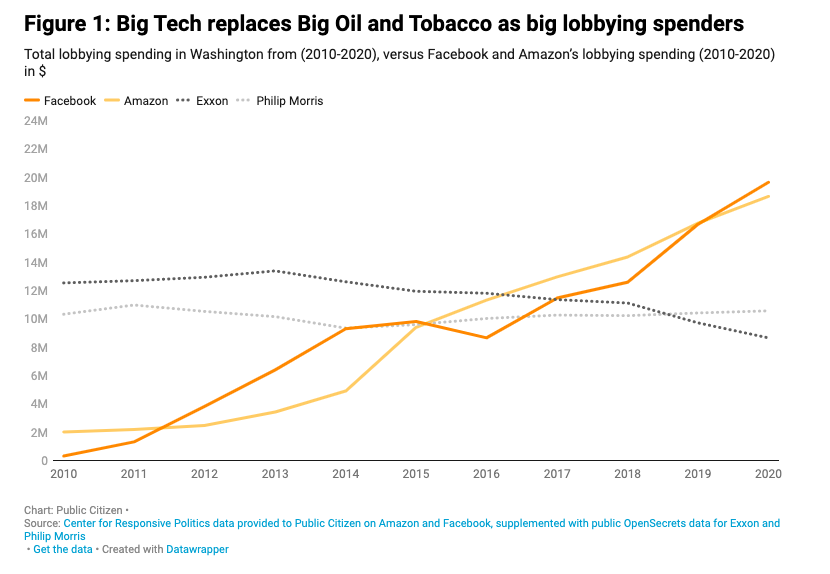

```{r global_options, include=FALSE}
knitr::opts_chunk$set(fig.pos = 'H')
```

The United States is currently facing a crisis of personal data privacy. In recent decades, a new era in the digital world---commonly termed the *Internet of Things*, or IoT---has emerged. The IoT refers to the devices and people who enable the sharing of data worldwide, and is used to characterize the modern internet age as one whose focus is now on big data.

Improvements in computing power and internet speed, alongside the development of new technologies capable of storing and utilizing massive quantities of data, have ushered in a new economic age: the data economy. Data is now a hot commodity, with the power to be incredibly valuable to those with the technology to utilize them. The Big Data Strategist at Oracle---a major software company---once said that "data is in fact a new kind of capital on par with financial capital for creating new products and services." *(When data is capital: Datafication, accumulation, and extraction)*. Data provides this value through several means: by enabling businesses to profile and target people, leading to higher success rates in attracting customers; by providing information that can be used to help optimize systems; by helping manage and control things; by allowing companies to model probabilities more accurately; and by allowing certain software to operate in a way that would not be possible otherwise.  *(When data is capital: Datafication, accumulation, and extraction)*

Much of this data comes directly from the general public---the people who use the goods and services produced by companies who participate in the data economy, such as Amazon, Google, and Facebook. Consumers' data is collected constantly. Amazon tracks users' purchases and voice commands---even going so far as to track the lines highlighted in books bought by Kindle readers. (https://www.theguardian.com/technology/2020/feb/03/amazon-kindle-data-reading-tracking-privacy). Google tracks every search users make, every YouTube video they watch, their full calendar schedule, their Gmail messages,everywhere they go, how long they stay there, and what route they take---even if Google Maps is not open (https://medium.com/swlh/an-in-depth-look-into-all-the-ways-google-tracks-you-in-2019-b158acf05b29). 

This large-scale data collection poses significant ethical implications when considering the potential effects on consumers. For one, there is the concern of data breeches. Since user data is collected and shared over the internet, it is at risk of being released---or taken for nefarious purposes---through cyber-hacking events. Just last year, hundreds of millions of facebook users' phone numbers, locations, and emails were stolen (https://www.npr.org/2021/04/09/986005820/after-data-breach-exposes-530-million-facebook-says-it-will-not-notify-users). Facebook is not alone; many other companies have seen serious data breaches in recent years: Yahoo, Experian, Twitter, and Microsoft, to name a few (https://www.informationisbeautiful.net/visualizations/worlds-biggest-data-breaches-hacks/). This danger is heightened further in situations involving private health or financial data, leaving consumers at risk of negative impacts from the release of sensitive health information, as well as possible identity theft and financial harm. Additionally, the misuse or unwanted release of information on polarizing issues such as religion, sexual and gender identity, or data indicating the use of abortion services could potentially put vulnerable consumers in harms' way---making them targets for attack.

There is also the danger that data, even in its intended use, can result in harms to consumers. Large scale data collection of consumers is often used to power machine learning algorithms, which use data to make predictions about people. These algorithms---though seemingly objective at first glance---are often negatively biased toward minoritized people (use definition from Data Feminism & cite!). For example, facial recognition algorithms built in large part off of Facebook photos misidentify black women at a significantly higher rate than other groups (source).

Data can also be used for psychological manipulation. Sites like Facebook and Twitter have a wealth of data on their users---enough to predict with high accuracy how they will react when exposed to certain stimuli. These sites can use that knowledge to spread targeted messages and actively change the beliefs held the public. This is what happened in the 2016 election, when Facebook's advertising system targeted those individuals it calculated to be likely susceptible to conservative messaging with advertisements that reflected the ideals of Donald Trump. Though not known for certain, it is widely believed that these advertisements may have convinced enough voters to support President Trump that he eventually won the election. (Source)

The practice of mass data collection is far from ethically sound. In spirit---though never declared by law---it violates one of the founding principles of the United States: individuals' right to privacy. The right to privacy is a crucial foundation of this country. It was first officially alluded to in the Fourth Amendment to the constitution---though it is implied to some degree in the First, Third, and Fifth as well---and has been reinforced at the highest levels of the judicial system for centuries. 

> The right of the people to be secure in their persons, houses, papers, and effects, against unreasonable searches and seizures, shall not be violated, and no Warrants shall issue, but upon probable cause, supported by Oath or affirmation, and particularly describing the place to be searched, and the persons or things to be seized.  -- Fourth Amendment

It also puts individuals' First and Fourteenth Amendment rights at risk. Freedom of speech and of expression are placed at risk through the danger of data breeches---users who fear that their data may be taken and used by unauthorized individuals may refrain from sharing controversial opinions or personal information on religion, sexual orientation, or other sensitive matters online, for fear that it may be used against them, when they would have otherwise done so if not fearful of an information breach. The equal protection clause of the Fourteenth Amendment is likewise threatened. Although not necessary intentional, the bias present in the mass public/consumer data algorithms has the effect of treating equal groups differently, which---if used in certain circumstances---can violate the principle that all people deserve equal protection under the law.

Now, more than ever, Americans have lost faith in the ability of companies to protect their private data, and trends only seem to be getting worse (http://www.pewinternet.org/2017/01/26/americans-and-cybersecurity/).

Despite all of the dangers and ethical concerns inherent in mass data collection, companies still continue to practice it because of the significant capital benefits. Lawmakers in the United States have recognized the problem and attempted to solve it through legislation, but their efforts have fallen short. The US has failed to produce any comprehensive legislation on data privacy at the federal level and at the state level there exists only a patchwork of laws, plagued by inconsistencies, conflicting information, and sub-optimal enforcement procedures (https://www.cfr.org/report/reforming-us-approach-data-protection).

Healthcare data is by far the most protected variety, though even it lacks a clear and comprehensive piece of legislation. The Health Insurance Portability and Accountability Act (HIPAA) only applies to certain "covered entities," the list of which is often unclear to the general public. Student health records are covered under a different law, the Family Educational Rights and Privacy Act, which occasionally combines or conflicts with the Children's Online Protection Privacy Act (COPPA), meant only to protect the data of children under 13 years of age.

This failure to protect personal data is unique in the industrialized world. 128 countries out of 194 worldwide have put in place national data protection laws (https://unctad.org/page/data-protection-and-privacy-legislation-worldwide), many of which are quite strict and offer citizens significant control over the use of their data.

Citizens of the European Union (EU) are protected under the Global Data Protection Regulation (GDPR), a comprehensive piece of data privacy legislation which gives individuals in the EU the power to control what data is collected on them and what is done with it in addition to restricting the transfer of personal data from EU members to other countries. The GDPR is relatively expansive, providing consumers with a wide variety of privacy protections including requirements that individuals be quickly notified in the event of a data breach and that---at a minimum--- identifiable data must be pseudonymised. Additionally, EU citizens are given rights to access and control their data. Under GDPR, individuals have the right to access information about what is being collected of them, the right to rectify mistakes, the right to have their data erased or to restrict/object to processing, as well as rights related to automated decision making and profiling. Companies (data "controllers") are required to meet high privacy standards, and there are systems in place to ensure compliance. These include Data Protection Officers, appointed to help observe and promote compliance, alongside a tiered fine system for GDPR violations.

Major countries in other continents also have much stronger data protection laws than the United States. South Korea, for example, has the Personal Information Protection Act (PIPA). This law is very similar to the GDPR, with requirements for at least pseudonymising the data. PIPA also contains rules for measures that must be taken when handling personal data to ensure privacy. Express consent is required for the collection of personal data, with a specific focus on sensitive data. Information such as passport or drivers license number and information about ideology, religion, health, sexual orientation, or other sensitive subjects must be collected separately from one another *and* separately from any other consent. Citizens also possess similar rights to under the GDPR, including access, correction, suspension of use, and removal of personal data.

Some countries have even gone so far as to declare data privacy a fundamental right. In Chile, the official constitution (Article 19, Number 4) establishes the individuals right to (i) respect and protection of private life, (ii) honor of the person and his/her family, and (iii) **protection of his/her personal data**. Anyone whose rights are threatened or disturbed has the power to file a Constitutional Protective Action in response. (https://www.dlapiperdataprotection.com/index.html?t=law&c=CL)

Despite our apparent constitutional focus on privacy, it is clear that the United States trails far behind other developed countries in terms of data privacy protections. Why is this?

Perhaps the most important factor in preventing nationwide data privacy regulation is the role of the technology lobby in politics. Many of the world's most powerful technology companies are headquartered in the United States: Facebook, Google, Microsoft, Twitter, and Oracle, to name a few. Bringing in hundreds of billions of dollars in revenue, these companies play a pivotal role in the US economy, and as a result have a lot of political power. Their massive profit margins enable these companies to lobby the US government, preventing the passing of laws and policies that are not in their best financial interest. Alphabet Inc, the parent company of Google, spent 21.74 million dollars trying to affect US policy in 2018 (https://www.investopedia.com/tech/what-are-tech-giants-lobbying-trump-era/), and Facebook spent 19.68 million in 2020. (https://www.citizen.org/article/big-tech-lobbying-update/). Technology companies have now surpassed Big Oil and Big Tobbacco---the previous most powerful lobbying groups---as the biggest spenders in US politics, and their spending is only increasing over time (https://www.citizen.org/article/big-tech-lobbying-update/). A privacy law is counter to these companies' best interests. Additional requirements for data security, limitations on what can be collected, and financial punishments for non-compliance risk damaging these companies' profits, which rely partially on large-scale data collection. Technology companies do not want to see a privacy law passed, and have the funding and power available to prevent any drastic changes from happening.

```{r, out.width = "100%", echo = FALSE, fig.cap = "Source: https://www.citizen.org/article/big-tech-lobbying-update/"}

```


There is also the issue that the United States does not currently possess any agency that has the ability to fully manage and ensure compliance with a federal data privacy law. In the EU, all of the member states have independent privacy-focused authorities to enforce the GDPR. The US has nothing like that. The closest thing is the Federal Trade Commission (FTC), which has historically managed other aspects of consumer protection and privacy (https://www.newamerica.org/oti/reports/enforcing-new-privacy-law/the-ftc-is-currently-the-primary-privacy-enforcer-but-its-authority-is-limited/). However, it is relatively weak in its powers: it is constrained in its authority, with jurisdiction primarily in interstate commerce. The FTC can only regulate violations that meet standards for "unfairness and deception," but these are poorly defined and unclear. Furthermore, the FTC lacks a strong record of privacy enforcement---even in previous cases where it has had the jurisdiction to intervene---and does not have leadership with a strong level of technological expertise in the field of data privacy (https://www.newamerica.org/oti/reports/enforcing-new-privacy-law/the-ftc-is-currently-the-primary-privacy-enforcer-but-its-authority-is-limited/).

Due to the power of the technology lobby and the lack of enforcement ability, it is difficult to imagine a large-scale, universal data privacy law like the GPDR being passed at the national level any time in the near future. If one were pushed in congress right now, it would almost certainly fail, both under arguments that it is un-enforcable and under pressure from big tech. Instead, we will have to take a slower, step by step approach, taking careful consideration at each step to prevent dramatic counteraction from technology companies.  

The first step necessary will likely be either the creation of a new data protection agency or the bolstering of FTC powers to include more oversight capability for privacy regulation. A data protection law without an agency capable of overseeing compliance will be useless, so this step should be completed first. As this action does not directly and immediately financially impact technology companies, it is also one of the more feasible policy actions available at the moment.

In the mean-time, states should continue to create their own data privacy regulations, though with additional thought to ensure that their proposed laws are consistent with those that have already been passed. Although a patchwork of state laws is not optimal, the more that individual states begin to push for privacy legislation, the more pressure is put on the federal government to enact a policy nationwide, as it becomes clear that the public desires change. 

In the long run, however, a state-by-state patchwork will not be sufficient and we will need a comprehensive federal law to ensure that guidelines are consistent and all citizens are protected. The passing of this legislation should be done with great care. Lawmakers should focus primarily on methods for prevention of privacy failures, rather than on mechanisms for punishment after the fact. This will ensure that the financial harms to technology companies---in the form of large non-compliance fines---will be minimized, making the law more palatable to the technology lobby. Due to the significant political polarization in United States, it is also important to ensure that any data privacy regulations that are suggested are written in a way that is favorable to both the Democratic and Republican parties---and, if possible, put forward by a bipartisan coalition---so that the law is not put on hold for political reasons. There is evidence that members of both parties have been supportive of privacy regulation in the past (https://www.commerce.senate.gov/2020/6/cantwell-cassidy-and-klobuchar-introduce-bipartisan-legislation-to-protect-consumer-privacy-promote-public-health-for-covid-19-exposure-notification-apps), so this goal is not un-achievable.

This should be done 

- Create a data protection agency
- focus on prevention, not monetary punishment (better incentives for companies)
- widen the definition of what can count as a data-privacy related harm to afford more opportunities to individuals to take problems to court as well as what is considered sensitive data
https://www.cfr.org/report/reforming-us-approach-data-protection
- On the statewide level, if wanting to create laws, do so with an eye for making them consistent. Once a majority of states have them, more pressure for federal change
- Eventually do need federal law. Should attempt to get both Republican and Democratic support which apparently already exists (https://www.theregreview.org/2021/03/13/saturday-seminar-how-should-united-states-protect-data/)


Problem setup:

- In US, big challenge w/ information privacy:

1. the internet of things (https://lawdigitalcommons.bc.edu/cgi/viewcontent.cgi?referer=&httpsredir=1&article=3622&context=bclr)

2. data commodification -- data as capital (https://www.google.com/url?sa=t&rct=j&q=&esrc=s&source=web&cd=&ved=2ahUKEwiD8NynpIXwAhWnAZ0JHS2aDpsQFjACegQIAhAD&url=https%3A%2F%2Fresearch.monash.edu%2Ffiles%2F303893944%2F303893762_oa.pdf&usg=AOvVaw09nsGbgbaIQ7dJa-sP-ITn) (https://columbialawreview.org/content/paying-for-privacy-and-the-personal-data-economy/)

3. Dangers:

  - data breaches + data used against you (financial info, identity theft, health data particularly damaging)
  - interest targeting a very powerful tool to cause dangerous psychological shifts (see FB scandal)
  - tools to enable exclusion (see sexual orientation scanner, ER triage algorithms)
  - bias
  
  https://lawdigitalcommons.bc.edu/cgi/viewcontent.cgi?referer=&httpsredir=1&article=3622&context=bclr
  
4. Current protections in us:
  https://columbialawreview.org/content/paying-for-privacy-and-the-personal-data-economy/
  https://iclg.com/practice-areas/data-protection-laws-and-regulations/usa
  https://www.cfr.org/report/reforming-us-approach-data-protection

6. What other countries have done that we haven't

- GDPR in EU https://gdpr-info.eu
- South Korea https://iapp.org/news/a/gdpr-matchup-south-koreas-personal-information-protection-act/ ,  https://papers.ssrn.com/sol3/papers.cfm?abstract_id=2904896
- Chile https://cms.law/en/int/expert-guides/cms-expert-guide-to-data-protection-and-cyber-security-laws/chile https://www.eff.org/deeplinks/2020/09/look-back-and-ahead-data-protection-latin-america-and-spain 


  
5. Why it's hard for us to do the same

- We don't currently have an agency that could be focused on managing data protection --- closest is FTC but they don't have oversight power of lots of private companies
- Powerful tech lobby at federal level has huge leverage on voting
- All the states are so different from one another so state-only laws would be a challenging patchwork if not controlled
- potentially not enough public support. In US, we're just used to our data being used all the time. However, concern does seem to be growing.

https://www.washingtonpost.com/news/powerpost/paloma/the-cybersecurity-202/2018/05/25/the-cybersecurity-202-why-a-privacy-law-like-gdpr-would-be-a-tough-sell-in-the-u-s/5b07038b1b326b492dd07e83/

It COULD work though --- look at HIPAA!! It is super strict in the healthcare industry, and goes pretty smoothly. tech companies have adapted to make HIPAA compliant software

7. What we should do

DON'T TRY TO CREATE WHOLE PRIVACY LAW --- will not work in the current climate. No way to enforce and considerably too big of a jump. Work in smaller steps w/ less punishment

- Create a data protection agency
- focus on prevention, not monetary punishment (better incentives for companies)
- widen the definition of what can count as a data-privacy related harm to afford more opportunities to individuals to take problems to court as well as what is considered sensitive data
https://www.cfr.org/report/reforming-us-approach-data-protection
- On the statewide level, if wanting to create laws, do so with an eye for making them consistent. Once a majority of states have them, more pressure for federal change
- Eventually do need federal law. Should attempt to get both Republican and Democratic support which apparently already exists (https://www.theregreview.org/2021/03/13/saturday-seminar-how-should-united-states-protect-data/)

