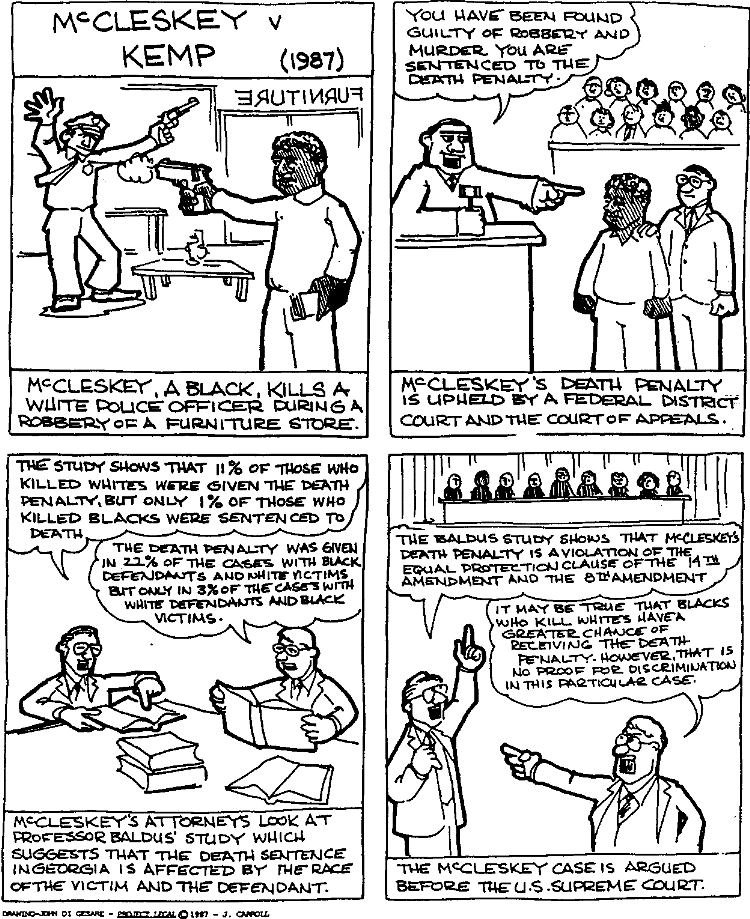

$~$

In the introduction to *Data Feminism*, the authors detail the story of human computer Christine Darden, who played an incredibly important role in ensuring the safe travel and return of several major NASA missions. Although she was highly qualified for her position, and skilled enough to be promoted far beyond the role of computer, Darden faced many challenges in her time at NASA--finding herself left to stagnate in her role, while her male counterparts were constantly promoted to positions for which she was equally qualified. That is, until a colleague of hers, Gloria Champine, presented a data visualization to Darden's boss, which illustrated the biased promotion practices of the organization. The data proved a point which could not be refuted, her boss gave in, and Darden received her well-deserved raise. 

$~$

```{r, echo = FALSE, fig.cap = "NASA Computer Christine Darden", fig.align='center'}

```

$~$

This story, however, stuck out to me as being a rare occurrence. While data are incredibly powerful as potential forces for positive change, most of what I have read and studied indicates that positive outcomes are not all that common. Instead, data are regularly used to perpetuate systems of oppression--or, in some cases, thrown out as too general to be considered viable evidence in individual cases of discrimination. 

Darden's case is particularly interesting when considering the history of how data has been viewed in cases involving discrimination. Darden was able to use data showing a systemic problem--inequity across genders in the promotion process at NASA--as evidence that she, personally, was being discriminated against, which resulted in her gaining her desired end goal: a promotion. 

It was of course unfair that she needed to make this case in the first place, but still I found it incredibly surprising that she was able to win her promotion so easily. Historically, achieving success in discrimination cases such as Darden's with data was next to impossible. 

A court case of particular interest to me that focuses on this topic is that of *McCleskey v. Kemp* (US Supreme Court, 1987). This case revolved around the issue of the death penalty, with the petitioner arguing that he was racially discriminated against in the receipt of his death sentence. The main piece of evidence used to demonstrate his point was a study on the racial factors in death sentence imposition, which indicated clear disparities in based on the race of both accused murderers and their victims. Although the evidence strongly demonstrated systematic bias, the court ruled that the statistics were insufficient proof: although they illustrated a systematic problem of discrimination, they did not prove that the defendant himself--specifically--was discriminated against. As a result, his death sentence stood and future defendants could no longer have hope of using data to argue their case. This case was pivotal in the history of the death penalty, but also had implications all across the legal world. The Supreme Court, by declaring the data inadequate, set a precedent that weakened its strength as a tool to protect those facing discrimination. This case, which occurred a little over three decades ago, has yet to be overturned in a major way.

$~$

```{r, echo = FALSE, fig.cap="A Short Graphical Summary of McCleskey v. Kemp", fig.align='center'}

```
$~$

If the highest court in the United States does not value data as evidence of discrimination, it begins to beg the question of how we will ever be able to use data to their full positive potential. Christine Darden was able to do so, but she was lucky and had the support of colleagues who were convinced by her evidence. Not everyone is so fortunate. It is wonderful to see positive change--such as the publishing of this book and and an increase in discussions around ethics and bias in data use--but unless things are recognized as a problem nationwide, and the legal system provides full support, it is hard to visualize a positive future for data.
